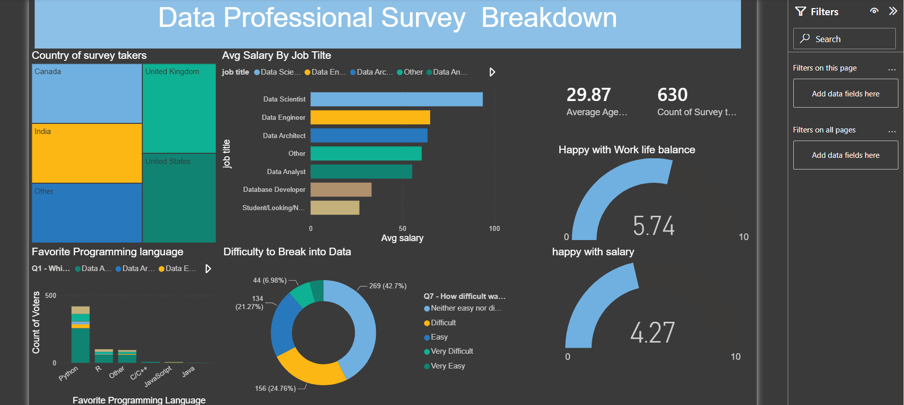

# Data Professional Survey Analysis Dashboard

## Overview
Interactive Power BI dashboard analyzing survey responses from data professionals.
## Dashboard Preview

## Tools Used
- Power BI
- Power Query
- DAX
- Excel

## Dashboard Features
- Salary Analysis
- Country-wise Breakdown
- Programming Language Preferences
- Work-Life Balance Analysis
- Career Difficulty Analysis

## Skills Demonstrated
- Data Cleaning
- Data Transformation
- Data Visualization
- DAX
- Business Intelligence

## Author
Adwaid V Nair
